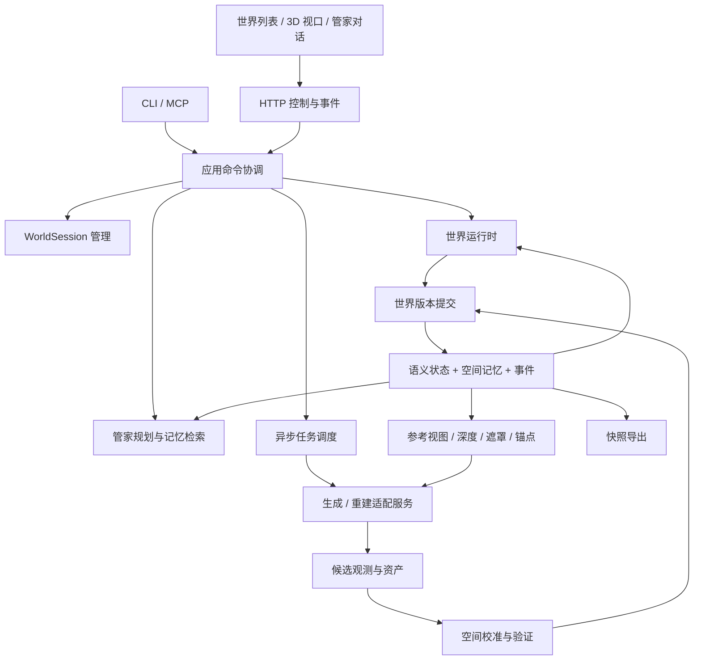

# Carina v1.0 模块与数据架构

> 2026-09-11：最新运行时部署、模块边界与状态权威划分见[下一代开发方案 NG-1](docs/NEXT_GENERATION_PLAN.md)。本文保留世界/session与数据架构背景；冲突处以新方案为准。

日期：2026-09-10。性质：目标架构，新增模块与接口尚未实现。产品定义以 [PRD v1.0](PRD.md) 为准，排期见 [实施路线](NEXT_ITERATION_PLAN.md)。

## 1. 架构目标

让一个长期 WorldSession 同时拥有管家上下文、可恢复语义状态和可运行三维空间。生成模型输出候选内容；空间校准将候选升级为持久记忆；运行时播放并执行这份记忆；后续生成和导出均引用它。

LLM 不做逐帧控制、不直接写世界文件；生成服务不拥有权威世界状态；浏览器显示和预测不构成已提交事实。所有写入口使用一个应用命令协议。



图是业务数据流，不代表每条箭头都应形成直接代码 import。具体依赖如下。

## 2. 目录及责任划分

维持单仓库，先用目录边界而非拆成多包。新增目录随里程碑落地，文档不要求一次性创建空模块。

### 2.1 `src/schema/` — 共享契约

负责 session、命令、世界版本、空间资产、任务、能力声明、事件与导出 manifest 的 Zod schema。保留旧版 schema 用于迁移读取，新版类型严格区分观测、候选和已提交结果。

公开契约：WorldSessionRecord、WorldCommand、WorldSnapshot、RegionRevision、SceneObject、ObservationBundle、GenerationPlan、CalibrationPlan、CandidateRevision、ValidationReport、JobRecord、ProviderCapabilities、ExportManifest、RuleDocument、GlobalProfile、WorldRules。

只能依赖 Zod 和纯类型基础，不依赖 fs、网络、LLM 或渲染引擎。错误返回稳定 code，由壳层双语展示。

### 2.2 `src/pack/` — 存储、资产与提交

从当前目录/zip 功能扩展为版本化世界存储。负责内容寻址资产、快照、提交日志、校验和、原子更新当前指针、备份及版本迁移。大二进制不放 graph.json 或 SSE。

建议 API：openPack、readSnapshot、stageAssets、commitRevision、restoreCheckpoint、importPack、exportPack。只有此模块写权威包文件；业务模块输出变化提案。

提交记录要包含恢复需要的完整差异和资产引用；graph.json、MEMORY.md、当前场景索引是投影。世界规则文档（WORLD.md / PLAYER.md / STEWARD.md / MEMORY.md / skills）随 revision 内容寻址，提交记录保存哈希。日志尾部中断不应破坏此前完整提交。资产先持久化，提交记录确认后再更新 HEAD；恢复扫描有效提交。采用单一写入队列、原子 rename 与必要落盘同步，故障注入覆盖每一步。

### 2.3 `src/sessions/` — 世界生命周期

负责世界 registry、新建/打开/切换/暂停驻留、唯一写入租约、worldId 解析、检查点恢复和预算配置。registry 位于应用数据目录，包可移走后重新注册。同一目录存放不属于任何世界包的全局规则档案。

建议 API：createSession、openSession、switchSession、suspendSession、closeSession、listSessions、readGlobalProfile、updateGlobalProfile。切换必须先确认旧世界已暂停并保存，再把 active 指针移给新世界；新世界打开失败保留旧世界可恢复。

同一 worldId 被重复导入时显式选择打开原世界或克隆新 ID。providerSession 按世界隔离并可重建，不持有跨世界全局“上一帧”。全局档案变更不改写已暂停世界的空间资产，只影响之后的管家回合。

### 2.4 `src/world/` — 语义状态与规则

保留现有图谱、presence 和事件能力，升级为类型化领域状态、前置条件、效果计算和有效事实查询。对象归属、门锁、人物可知信息、目标和状态均可验证。用户编写的 WORLD.md 中可提取条款编译进 WorldRules；无法结构化的散文仍作为管家约束，不假装已在物理层执行。

建议 API：resolveIntentTargets、validateAction、reduceEffects、queryEffectiveFacts、projectCommit、compileWorldRules。输出 effect patch，不自行写盘。事实带来源和有效版本；历史 Claim 不自动覆盖当前状态。玩家动作必须通过 WorldRules 与对象约束，不能只靠模型“记得规则”。

七类语义节点可沿用。空间坐标、网格和碰撞通过 sceneObjectId/assetId 关联，不能把完整几何塞进任意 props。运行时对象与语义节点一一或显式一对多映射。

### 2.5 `src/spatial/` — 空间记忆、校准与固化

负责区域划分、统一坐标、尺度锚点、对象绑定、空间版本、保护范围、几何差异和固化质量验证。

内部可分 observation、registration、constraints、objects、validation、reference-view 六个子目录。初期简单实现即可，不各建独立服务。

建议 API：buildCalibrationPlan、registerCandidate、validateSpatialCandidate、buildReferenceBundle、planRegionCommit。重建推理通过 provider 接口完成；本模块负责如何使用其结果，不 import GPU SDK。

校验至少包括：尺度/坐标合法、边界对齐、几何覆盖、保护对象未变、碰撞可用、出生点与通路、独立对象映射、视觉参考一致。quality 报告注明检测方法、阈值、未覆盖区域和人工检查，不使用一个不透明总分代替全部验收。

### 2.6 `src/providers/` 与 `sidecars/` — 模型能力适配

拆开 GenerationProvider 与 ReconstructionProvider；同一外部服务可实现两者。声明能力、接收控制计划、返回观测/三维候选、报告进度与取消状态。原生 3D 后端可跳过视频重建，但不能跳过坐标、碰撞、对象和导出检查。

建议接口：getCapabilities、openProviderSession、submitGeneration、submitReconstruction、pollJob、cancelJob、closeProviderSession。参考条件由统一 ReferenceBundle 传入，不向上层泄漏某一家私有 prompt 格式。

TypeScript 只负责 HTTP/流协议、参数转换与结果校验。LingBot、相机/深度重建、网格处理等重依赖在独立 Python/GPU sidecar。当前 `sidecars/lingbot-still` 保留为 legacy adapter，其固定轨迹短片能力必须如实标识。

服务不能直接修改世界包；返回内容由 pack 存储并由应用层提交。鉴权凭据在宿主配置；持久包存 provider 名称/版本/来源，不存 token。

### 2.7 `src/jobs/` — 可取消异步任务

负责生成、补采集、校准、网格加工、导出等长任务的队列、限额、取消、重试、进度与恢复。每任务绑定 worldId、jobId、baseRevision、相关 region/object readSet、controlEpoch、用途及预算。

建议 API：enqueueJob、cancelJob、observeJob、reconcileJobs、isResultApplicable。控制命令不排入 GPU 队列。停止提交与远端停止计算分别记录；不支持取消的任务可隔离输出并等待结束。

恢复时向 provider 查询已知任务，不因客户端重试重复计费或生成。自动修复最大次数与耗时预算由配置控制，首版默认至多两轮；耗尽后保持已提交空间并展示问题。

### 2.8 `src/runtime/` — 世界时间、运动与交互

负责世界时钟、固定 tick、导航/碰撞、对象状态、NPC 简单行为、暂停屏障和运行检查点。权威状态在本机 daemon；前端做相机显示与必要插值。具体物理实现通过接口选择，首版以可验证的简单角色移动/碰撞为主。

建议 API：startWorld、pauseWorld、stepWorld、applyCommittedScene、executePlayerAction、snapshotRuntime。稳定区域用已提交场景运行，不让 LLM 或生成视频决定每帧位置。

相机观察与玩家实体位置分开，暂停时观察相机可动。动态对象以对象资产 + transform/animation 状态存在，不能烘焙进静态背景。世界时钟推进和状态检查点不要求每帧写全量图谱：记录动作/决策和周期快照；恢复以已确认快照及后续提交为准，不能声称可以精确重演未记录的浮点物理或模型输出。

### 2.9 `src/steward/` — 管家规划和自然语言解释

继续作为唯一调用 LLM SDK 的模块。分意图识别、目标解析、生成规划、校准规划、结果解释、上下文检索；这些是同一个管家的阶段，不是首版的多 Agent 系统。

建议 API：interpretCommand、planGeneration、planCalibration、proposeNpcDecision、explainResult、proposeRulePatch。上下文按 worldId、目标区域和对象读取，并始终载入当前全局档案与本世界规则文档，不混用其他世界的 WORLD.md / MEMORY.md。对话历史可压缩，权威状态、规则文档哈希和空间引用不能只存在于压缩摘要。WORLD.md 硬规则与全局硬边界不截断。

规则修订必须产出可展示的文档补丁（文件、段落、前后文），由 application 提交；管家不得直接写盘。明确“暂停/继续/停止移动”等高优先指令有确定性快速识别。复杂语言由模型转为 WorldCommand。工具执行通过注入的接口请求应用层；steward 不 import application，从而避免循环依赖。

### 2.10 `src/application/` — 命令与事务编排

这是各种壳共用的入口，负责命令授权范围、单世界串行写入、planner 调用、runtime 控制、任务提交、候选验证与最终提交。

建议 API：dispatchCommand、getSessionView、subscribeEvents、applyCandidate、createExport、updateRuleDocument。工具、HTTP 和 CLI 都调用这里，不能各自持一份可写 WorldStore。规则面板保存与自然语言改规则都变成 `rules.update`，带 expectedRevision 与文档哈希。

长任务启动后释放协调队列；完成后带 readSet 回到提交队列验证。跨越暂停或 session 切换的旧任务默认不得自动推进世界。明确的暂停期编辑任务可以提交，但不推进 simTime。

### 2.11 `src/exporter/` — 建模资源与导出验证

负责 ExportProfile、快照解析、GLB 场景组装/对象拆分、材质打包、坐标转换、来源映射及报告。世界 zip 的低层写入复用 pack。

建议 API：planExport、validateExportInputs、buildModelExport、verifyExportManifest。视图 splat、可视 mesh、collider mesh 三类资源严格区分。导出不重新随机生成几何；需要补网格时先发独立转换 job，验证后再组成固定快照导出。

首版验证目标是 Blender，可自动检查 GLB 节点、变换和贴图引用，并做人工导入检查。对象 pivot、单位与层级必须可解释。导出 unsupported 信息，不默默丢弃用户要求的独立对象。

### 2.12 `web/` — 世界应用界面

替换当前 chat.html 的主要产品职责：世界列表、3D 视口、自然语言对话、对象选择、运行/暂停、任务进度、校准前后对比、检查点、规则文档编辑和导出。全局规则在应用级入口编辑，不挂在某一个世界的包上。

建议采用独立 Web 构建入口，使用 React/TypeScript 与浏览器 3D 渲染适配层。具体 Three.js/Babylon.js 及 splat 实现经样板实测后在 ADR 固定，不在 PRD 里把尚未验证的依赖写成已选型。核心 Node 包与浏览器构建边界明确；现有 tsconfig 不直接承担浏览器代码编译。

3DRenderer 必须能读取 mesh 场景；可按能力增加 splat 显示。自然语言和按钮发同一种命令；事件流更新已提交状态。前端不直接请求带 Key 的 GPU/provider 服务。

### 2.13 保留的壳与兼容层

- `src/server/`：鉴权、session 路由、控制 API、SSE 和媒体/资产响应；只调 application。
- `src/tools/`：将新世界工具映射为 WorldCommand，保留旧八工具兼容包装。旧写操作也必须走 application。
- `src/cli/`、`src/mcp/`：创建/选择世界、调用命令和读取资源，默认通过 daemon；无 daemon 的旧离线写操作只允许独占包锁后执行同一应用路径。
- `src/render/`：迁移期保留旧 look 适配，不成为新架构的全能入口；后续分别归入 providers（生成）与 web/runtime（显示）。
- `src/i18n/`、config、errors：继续共用，新增配置集中读环境。

## 3. 依赖与事实归属

schema 最底层；pack 依赖 schema；world 与空间/运行规则尽量使用纯数据。sessions、jobs、providers、runtime、spatial、exporter 依赖 schema 与注入的存储/计算接口。application 组装它们；server/cli/mcp 依赖 application；web 只依赖公共协议。

LLM 在 steward，GPU SDK 在 sidecars，权威写盘在 pack，提交协调在 application。单元测试可注入假的 planner/provider，但发布验收必须经过真实生成与固化。

唯一性规则：

- 对象身份与状态以提交中的语义状态为准。
- 几何、材质与变换以提交引用的区域/对象版本为准。
- NPC/玩家运动以 runtime 已确认状态为准，检查点固定这些状态。
- 图像识别/重建结果在提交前只是候选。
- 同一次 revision 的场景 manifest、语义快照和 runtime 检查点形成一致读视图。

## 4. 核心数据契约

### WorldSessionRecord

包含 sessionId（等于 worldId）、name、schemaVersion、lifecycle、runState、headRevision、controlEpoch、simTime、playerStateRef、worldRulesRef、ruleDocumentRefs、globalProfileRef、activeRegionId、budgetPolicy、createdAt、updatedAt。sessionId 使用 ULID；时间戳为 UTC ISO；simTime 明确为仿真秒。`globalProfileRef` 只记录当时引用的全局档案版本哈希，全球档案正文不写入世界包。

### WorldCommand

包含 commandId、worldId、intentKind、targetIds/regionId、arguments、expectedRevision、origin（自然语言/按钮/CLI/MCP）、mode（author/player）、requestedBy。高频相机输入单独用有序 control sequence；不依赖 LLM。

以上为世界内命令。session.create 属于 registry 命令，创建前没有 worldId，由 sessions 分配后返回；session.switch 显式区分发起上下文与 targetWorldId，不能把指代目标解释为当前包。复合自然语言指令形成有依赖的命令序列，每步报告实际提交结果。

标准类别：session.create/open/switch；world.run/pause/step；player.act/navigate；generation.start/stop/extend；spatial.calibrate/freeze；world.restore；export.create；rules.update（全局或本世界，参数含 documentId 与补丁）。工具名可映射成 SDK 合法形式，但不得改变语义。

### RuleDocument / GlobalProfile / WorldRules

RuleDocument 包含 documentId、scope（global | world）、path、revision、hash、body、updatedAt、updatedBy。World 范围文档的权威正文在包内；全局文档的权威正文在应用数据目录。

GlobalProfile 包含 identity、agent、globalRules 三份文档的当前哈希。WorldRules 是从 WORLD.md 提取出的可执行条款（移动限制、时间法则、锁定对象、生成禁忌），带 sourceSpan 指回原文。提取失败的段落保留为 stewardConstraints，不丢弃也不假装已编译。

读取顺序固定：产品硬约束 → GlobalProfile → 本世界 WORLD.md / WorldRules → PLAYER.md → STEWARD.md → skills → MEMORY.md 摘要 → 检索到的语义/空间记忆。不得把另一世界的规则或记忆切片注入当前回合。

### GenerationPlan / ReferenceBundle

包含 targetRegion、baseRevision、camera/trajectory、action/event、sceneDescription、referenceAssets、depth/masks、coordinateFrame、preserveConstraints、budget。referenceAssets 必须指向确定空间版本和内容哈希，方便证明后续生成确实读取了空间记忆。

### ObservationBundle

包含 frames/assets、camera intrinsics/extrinsics（若已知）、depth（若有）、timestamps、provider/model/version、control trace、estimatedScale、coverage、confidence、provenance。无法获得的属性明确 unknown，不填写假位姿。观测和补全分别标记。

### RegionRevision / SceneObject

区域包括 regionId、revision、bounds、coordinateFrame、anchorRefs、neighborPortals、visualRefs、colliderRefs、navigationRef、objectRefs、freezeState、quality、validationReportRef。

对象包括 sceneObjectId、semanticNodeId、parentId、assetRefs、transform、pivot、bounds、mobility（static/movable/actor）、interactionProfile、materialRefs。变换以米制右手系 Y-up 表示；非米制输入保存 scaleStatus 和转换来源。

不通过一个质量枚举假定拥有全部导出能力：quality 与可用资源清单一起检查。例如 playable 区域可有 splat + collider，但 editable 导出仍必须另有可视 mesh。

### CandidateRevision / ValidationReport

候选包含 baseRevision、readSet（region/object versions）、writeSet、proposedSemanticEffects、proposedAssets、constraintResults、sourceJobId。报告包括每条检查的 pass/fail/unknown、阈值、证据、未观测部分和适用质量等级。

未知关键检查不能自动判 pass。可视网格与碰撞网格更新必须同时验证；若只更新外观，应明确碰撞不变的依据。

### JobRecord

包含 jobId、worldId、kind、purpose（simulation/edit/export）、baseRevision、readSet、controlEpoch、providerJobId、status、progress、cancelCapability、attempt、budgetUsed、resultRefs。providerJobId 可用于恢复，不包括凭据。

每次 pause/switch/restore 增加 controlEpoch，屏蔽旧自动推进任务。长任务不因无关 NPC tick 一律作废：检查 readSet、保护约束和 epoch；只有依赖确实未变且允许的用途才可针对最新 HEAD 重新验证提交，否则 stale。

### ExportManifest

包含 exportId、worldId、snapshotRevision、profile、coordinateFrame、units、files/checksums、objectMapping、materialMapping、sourceAssets、license/provenance、unsupportedFeatures、validationResults。许可证信息保存来源与原文引用，不把未知权利写成可商用。

## 5. 包格式 v1 提案

```text
example.carina/
  manifest.json                 # 包版本与世界身份
  HEAD.json                     # 当前已提交版本指针，可恢复
  WORLD.md / PLAYER.md / STEWARD.md / MEMORY.md   # 本世界用户可编写规则，随 revision 哈希
  commits/<revision>.json       # 不可变提交记录，含 parent 与完整差异
  snapshots/<revision>.json     # 图谱、空间和运行状态的一致快照
  graph.json                   # 当前语义投影，非唯一真相
  session.json                 # 当前 session 投影
  scene/regions/<id>/<rev>.json
  scene/objects/<id>/<rev>.json
  assets/<hash>.<ext>           # 网格、splat、材质、碰撞等
  observations/<captureId>.json
  dialogue/<segment>.jsonl
  jobs/<jobId>.json
  checkpoints/<id>.json
  skills/*/SKILL.md
```

应用数据目录另存全局档案，不属于世界包：

```text
<appData>/profile/
  IDENTITY.md    # 创作者身份，对应 identity.md
  AGENT.md       # 管家默认人格与工作方式，对应 agent.md
  GLOBAL.md      # 跨世界硬边界与偏好
  profile.json   # 当前哈希与 schemaVersion
```

包内相对路径统一 POSIX。资产依赖由 manifest 显式列出；快照导出收集可达引用并验证 hash。导出或 checkpoint 正在引用的文件不能垃圾回收。首版不自动清理用户历史资产；生命周期清理后置。

v0 迁移先生成备份和迁移快照，保留原 events 文件为 legacy history。旧事件不足以重建完整对象状态，不能伪造完整事件溯源。导入时现有 graph/session 是迁移基线，旧 Claim 标记为 legacy facts；无 3D 的旧世界显示未固化，不自动升级 playable。

## 6. 三个关键时序

### 6.1 生成 → 校准 → 固化

application 固定世界基线，jobs 调用 provider 生成候选；spatial 检查覆盖/几何，必要时在预算内补采集。验证生成 playable 所需资源后，application 验证 readSet，将语义绑定与空间索引交 pack 一次提交。runtime 加载新版本，server 广播 committed。任何阶段失败，HEAD 不变。

### 6.2 暂停 → 编辑 → 继续

控制请求优先抵达 runtime，增加 controlEpoch 并冻结 simTime。任务调度取消/隔离自动推进任务。用户编辑生成 purpose=edit 的新任务，完成后允许在 paused 状态提交；恢复时重新同步 runtime 与 provider 参考，禁止播放旧 epoch 的世界推进内容。

### 6.3 固化世界 → 再生成

spatial 从选定区域版本构造参考视图/深度/遮罩/边界锚点，provider 生成扩展候选。保护区引用保持原样，候选只提交 writeSet 内区域；接缝检查通过后连接 portal。无法满足边界时保持候选，不以整区随机重建掩盖接缝失败。

## 7. HTTP 与事件协议提案

这些是待实现 API，不是现有服务支持列表。

- `GET/POST /v1/sessions`：列表/新世界。
- `POST /v1/sessions/:worldId/open`：激活并加载指定世界。
- `POST /v1/sessions/:worldId/commands`：统一自然语言或结构化命令，返回 commandId/接受结果。
- `POST /v1/sessions/:worldId/control`：pause/run/step/stopNavigation；高优先级、幂等、无需等待 LLM/GPU。
- `GET /v1/sessions/:worldId/events`：可续接 SSE。
- `GET /v1/sessions/:worldId/snapshot`：一致读视图及 HEAD revision。
- `GET /v1/sessions/:worldId/assets/:assetId`：有范围的资产访问。
- `POST /v1/sessions/:worldId/jobs/:jobId/cancel`：取消请求和能力说明。
- `POST /v1/sessions/:worldId/exports`：基于固定 revision 创建导出。
- `GET/PUT /v1/profile/documents/:documentId`：全局规则文档。
- `GET/PUT /v1/sessions/:worldId/documents/:documentId`：本世界规则文档；PUT 即 `rules.update`。

事件 envelope：eventId、worldId、revision、controlEpoch、commandId/jobId、type、payload。包括 command.accepted/rejected、world.paused/running、job.progress/failed、candidate.ready、world.committed、export.ready。SSE 断线用 Last-Event-ID 续接，历史过期时重新取 snapshot；客户端按 worldId 和版本过滤。

首版 SSE 负责状态/任务，控制通过独立 HTTP。高频移动在本机运行时与浏览器控制层完成；如需要跨网络实时输入，后续单独引入 WebSocket，不能让大 JPEG/base64 流阻塞暂停。

## 8. 现有代码迁移

先保留原测试和 CLI 可用性。引入 WorldSession 与单写命令门面，再把工具写盘路径接入；实现 pack v1 后迁移旧包。新 provider 契约与旧 render 并存，旧后端声明 legacy 能力。

现有 chat.html 作为调试入口保留到新 web 能处理世界切换/控制、规则编辑后退居开发用途。逐步替换“记忆文本=状态”的实现；旧 tool 输出兼容，但效果来自新版事务。旧版只读 MCP 的 WORLD.md / MEMORY.md 资源在 M1 改为经 application 的读写命令。

当前各模块注释和 README 旧用法在实现迁移时同步更新。不要在文档阶段把尚未实现的方法加入真实导出 API，制造接口存在的假象。

## English summary

The architecture separates persistent world sessions, user-authored global and world rule documents, semantic rules, spatial memory, simulation, model providers, asynchronous jobs and exports. A shared application command layer owns orchestration; pack owns durable world writes; the app profile owns global identity/agent/global rules; steward owns LLM calls; GPU dependencies remain in sidecars.

Generated observations are candidates. Validated spatial revisions become memory and constrain future generation. A local runtime plays committed regions. Commands, jobs and event streams are scoped by world identity, revision and control epoch. This document defines proposed modules and contracts, not implemented APIs.
